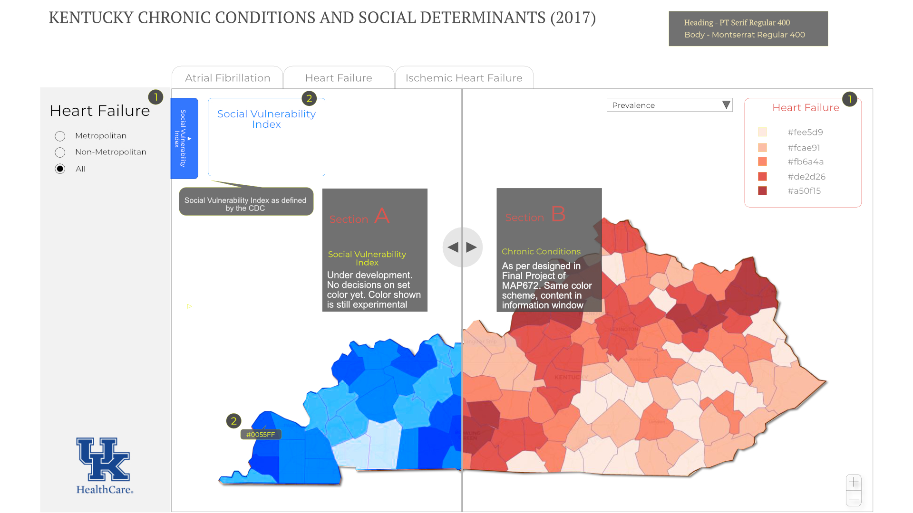

#

# HealthKY

## Overview

This map project is broadly entitled "CHRONIC CONDITIONS - KENTUCKY (2010 - 2017)". With an underlying philosophy that large data is pivotal to the best map design utility, this project is an attempt to significantly broaden mapping capability by incorporating and utilizing larger data sets. Focused on the prevalence of 21 health chronic conditions, spanning across 2010 to 2017 across all Kentucky counties, the map will feature a data panel to include information on expenditure per capita and the social vulnerability index (SVI) as defined by the CDC respective of each county. Evidently, the sheer volume of data utilized here should be above and beyond the amount that were introduced and provided during previous MAP673 project modules.

The major chronic conditions considered in this map are as follows:

| Chronic Conditions  |                          |                        |
| ------------------- | :----------------------: | ---------------------: |
| Alcohol Abuse       | Chronic Kidney Conditions| HIV/AIDS               |
| Alzheimer           | COPD                     | Hyperlipidemia         |
| Asthma              | Depression               | Hypertension           |
| Athritis            | Diabetes                 | Ischemic Heart Disease |
| Atrial Fibrillation | Drug Abuse               | Osteoporosis           |
| Autism              | Heart Failure            | Schizophrenia          |
| Cancer              | Hepatitis                | Stroke                 |

Taking advantage of the power of D3 javascript libary, this project will incorporate the following key features:

- Choropleth map of Kentucky counties illustrating the prevalence of chronic conditions.
- Navigation panel that includes dropdown menu of the chronic conditions listed above.
- Side bar with 3 tabs:

    1. Overview
    2. Analysis - Dashboard style view that allows viewers to hav a more indepth understanding of the characteristics of the counties wit
    3. Graph of prevalence of chronic conditions (2010-2017) by county 

## Objectives
The primary objective of this project is to demonstrate the author's web mapping skills and UX/UI architecture capability by harnessing the power behind the integrated application of HTML, CSS, D3. Secondly, as discussed, this map is an attempt to expand mapping using larger data sets. Thirdly, by boldly selecting the just-introduced D3 javascript library (instead of the much familiar Leaflet library which was emphasized in MAP673), it is hoped that this project will enable the author to leapfrog to the next level of proficiency and understanding of the D3.js. 

Ultimately, on a more practical level, this web mapping initiative is intended to serve as a showcase to specifically impressed upon the medical research professionals involved in the social determinants of health  - a growing area of interests - the enormous potential value of web map design.

## User Requirements
From informal conversations, it is determined that medical professionals need the following:

- A visualization tool to identify current health disparity. This is important in order to design and implement social programs to target resources - addressing health issues timely and effectively.

- A better UI/UX in all aspects of data visualizations. Data visualizations improve communications across departments, management hierarchies, government agencies, community partners and other Subject Matter Experts(SME), and ultimately better decision-making process.

- Interactive web map and the ability to build best UX/UI web pages can be an important presentation and communication asset in the grant application process.

## Data Sources
The principal medical data sources are as follows:

- Center for Medicare and Medicaid Services)
    - [Utilization/Spending State Level: All beneficiaries 2007-2017](https://www.cms.gov/Research-Statistics-Data-and-Systems/Statistics-Trends-and-Reports/Chronic-Conditions/Downloads/CC_Util_Spend_State.zip)
    - [Prevalence - State Level: All beneficiaries by Sex and Age, 2007-2017](https://www.cms.gov/Research-Statistics-Data-and-Systems/Statistics-Trends-and-Reports/Chronic-Conditions/Downloads/CC_Prev_State_All_Sex_Age.zip)
 
- Center for Disease Control
    - [Vulnerability Index](https://svi.cdc.gov/)
    - Upon the advice of the instructor, the Social Vulnerability Index by the CDC is considered as an approximated measurement for social determinants for health. At this present time, this should suffice as future consultations with the user is expected to finalize the best social determinants for health index.

- US Census
    - [State Boundary](https://www2.census.gov/geo/tiger/GENZ2019/shp/cb_2019_us_state_500k.zip)
    - [US Urban Areas](https://www2.census.gov/geo/tiger/GENZ2019/shp/cb_2019_us_ua10_500k.zip)
    - [Census Tracts](https://www2.census.gov/geo/tiger/GENZ2019/shp/cb_2019_us_tract_500k.zip)

## Methods

The anticipated methods of thematic representation will essentially be chorolpleth web map with the following characteristics:
- 4 page tabs containing the HTML pages of maps representing each respective chronic heart conditions:
    - Atrial Fibrillation
    - Heart Failure
    _ Ischemic Heart Disease
    - Information
(Note: This is an update from previous version on the advice of the instructor)
- User Interface: 
    - Each page will consists of an `<aside>` for appropriate description and narratives
    - The map will feature a swipe capability utilizing the [MapBox Swipe GL](../Kentucky-Health/Samples/index_mapbox.html). The left map visualize the Social Vulnerability Index map whereas the the right-side map will display the type of heart chronic conditions.
    - The map allow selection of classifications: (i) urban; (ii) rural; and (iii) all through the use of radio-button
    - The map includes a drop-down menu for selections: (i) Prevalence; and (ii) Expenditure per capita

The mock-ups can be found the [Wireframe Folder](../kentucky-health/Wireframes) in this repositories. The updated wireframe is shown below:

*Wireframe-Module 7.*

This mapping project is ongoing. I will continue to update this document. Meanwhile, here are the links to the videos that accompany the mindmaps:

## Technology Stack
- QGIS will be the primary tool for data and information processing. Other tools for file conversions will be [Mapshaper](https://mapshaper.org) and [geojson.io](geojson.io).
- The map will predominantly be drawn with d3.js taking advantage of the robust capability to asynchronous call file.
- [MapBox Swipe GL](../Kentucky-Health/Samples/index_mapbox.html) will be used

## Appendix
- [Affects of Social Determinants on Heart Disease](https://1drv.ms/v/s!Al_WACz_cvVTgqBElxHVA02kyjGGDA?e=WaVuZO) - Version May 25, 2020

- [Affects of Social Determinants on Heart Disease](https://1drv.ms/v/s!Al_WACz_cvVTgqRilFTe-_QFQ0r5HQ?e=mD9Ahn) - - Version May 19, 2020
